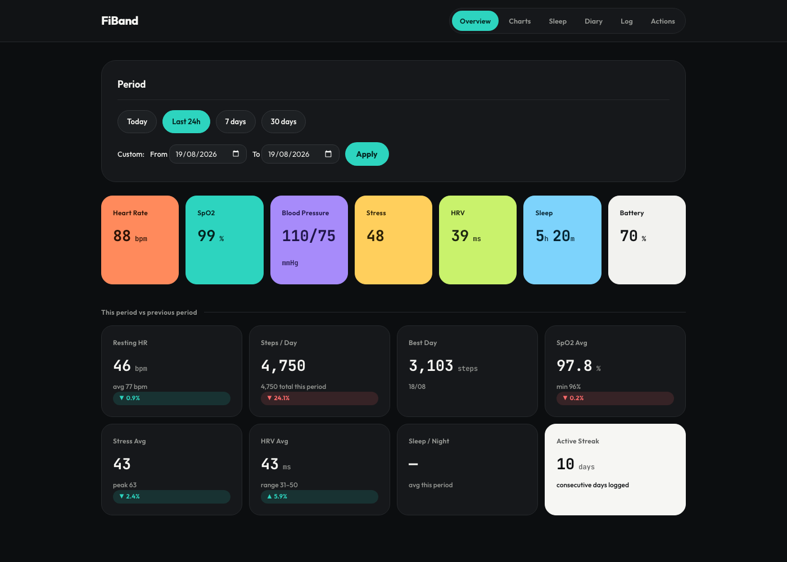

# FiBand — my H59 fitness band, no app needed



> **My own BLE dashboard for the H59 fitness tracker (Colmi/QWatch Pro protocol).** No cloud, no account: my health data stays on my own computer.


I built this to pull the real data off my **H59** band (heart rate, SpO2, blood pressure, steps, stress, HRV) **without the QWatch Pro app**: it talks directly to the device over **Bluetooth LE** (`bleak` / CoreBluetooth), stores everything in a local **SQLite** database, and shows the charts in a self-hosted **Flask dashboard** — a single Python codebase, with **optional AI analysis** of my health trends via OpenRouter.

**What it does:** a cheap smartwatch / fitness band (Colmi clones, QWatch Pro / QCWatch app) → raw data under my control, nothing sent to third-party servers.

## Components
- `app.py` — **Flask front controller / entry point**: dispatches the AJAX actions (`/action/sync|save_note|ai_prompt`) and renders one page (`?page=overview|charts|sleep|diary|log|actions`).
- `fiband/` — the whole backend, one Python package:
  - `config.py` — reads configuration from `.env` (band address, SQLite path, OpenRouter, timezone).
  - `db.py` — SQLite schema + connection (tables: `measurements`, `hr_samples`, `step_samples`, `stress_samples`, `hrv_samples`, `spo2_samples`, `sleep_segments`, `sleep_sessions`, `day_notes`, `ai_report`).
  - `store.py` — persistence layer (upserts, incremental-sync bookkeeping).
  - `band.py` — band BLE client (real-time measurements + history download, incl. the "rich" bc channel: SpO2 + sleep stages).
  - `collect.py` — collector: downloads history + on-demand measurements → SQLite. Called in-process by the `sync` action (no subprocess).
  - `dashboard.py` — data loader for the dashboard (period stats, local-day grouping).
  - `helpers.py` — formatting/timezone helpers + OpenRouter client.
  - `actions.py` — the three AJAX routes (`sync`, `save_note`, `ai_prompt`).
- `templates/` — Jinja2 page renderers: `base` (layout), `period` (range filter), `overview`, `charts`, `sleep`, `log`, `diary`, `actions`.
- `static/` — CSS/JS for the dashboard.
- `setup.py` — one-time setup (clock + 24/7 heart-rate logging).
- `start.command` — starts the dashboard.
- `docs/` — protocol notes and tools (see Layout).
- `requirements.txt` — Python dependencies (`bleak`, `flask`, `requests`).

## What I get
- **History** (fills up while wearing the band): heart rate (5 min), steps/calories/distance (15 min), stress (30 min), HRV (30 min), **SpO2 (hourly, min-max)** and **staged sleep** (light/deep/REM/awake).
- **On-demand** (instant measurement): heart rate, SpO2, blood pressure (sys/dia), stress.
- **AI analysis** (optional): send a 6-month summary — last 7 days in full detail plus a daily recap of the prior months — to a model via **OpenRouter** and get a health report on my trends (quick summary, full analysis and dietary advice), saved in the `ai_report` table.

## Requirements
- **macOS** (the BLE client uses CoreBluetooth via `bleak`).
- **Python 3.11+** — that's it. No PHP, no MySQL/MariaDB, no separate DB server: everything (BLE collector + web dashboard) runs as one Python process against a local **SQLite** file.
- An **H59** band (Colmi/QC protocol, QWatch Pro app).

## Compatible bands
The H59 is a whitelabel/rebranded module sold under several brand names — same hardware, same **QWatch Pro** app, same BLE protocol, so this project should work unmodified:
- **LIGE H59** — screenless smart bracelet (150mAh, 1ATM/IP68, HR/SpO2/BP/sleep), pairs via QWatch Pro. ([manual](https://manuals.plus/ae/1005008382993731))
- **LIGE H59MAX** — same family, larger feature set. ([manual](https://manuals.plus/ae/1005010734912937))
- Various no-name/Alibaba "H59" listings advertising the identical spec sheet.

If your band is sold under a different brand but pairs with **QWatch Pro** and identifies itself as `H59_xxxx` over BLE, it's almost certainly this same hardware.

## Setup

> The SQLite database and tables are **created automatically** on first run — no manual SQL needed.

1. **Create the Python environment** and install dependencies:
   ```bash
   python3 -m venv .venv
   .venv/bin/pip install -r requirements.txt
   ```
2. **Configure** by copying the template:
   ```bash
   cp .env.example .env
   ```
   Open `.env` and fill in `BAND_ADDRESS` (the default `DB_PATH=fiband.db` is fine as-is — no DB server to configure). If you want the SpO2/sleep history (the "rich" bc channel), also set `BAND_ACCOUNT` (QWatch username, part before the `@`). For the (optional) **AI analysis** add `OPENROUTER_API_KEY` (key from [openrouter.ai/keys](https://openrouter.ai/keys)) and optionally `OPENROUTER_MODEL`.
3. **Find the band address** (`BAND_ADDRESS`). Wear the band, turn off your phone's Bluetooth, then:
   ```bash
   .venv/bin/python -c "import asyncio; from bleak import BleakScanner; print('\n'.join(f'{d.address}  {d.name}' for d in asyncio.run(BleakScanner.discover())))"
   ```
   Copy the H59 device's address into `BAND_ADDRESS` in `.env`.
   *(On macOS this is a CoreBluetooth UUID, not a MAC: it is specific to your Mac.)*
4. **Initial band setup** (once — sets the clock and enables 24/7 HR logging):
   ```bash
   .venv/bin/python setup.py
   ```
   On first run macOS will ask for **Bluetooth** permission: allow it.
5. **Start the dashboard**:
   ```bash
   bash start.command          # or:  .venv/bin/python app.py
   ```
   Open **http://127.0.0.1:8080**.

## Daily use
1. **Wear the band** and **turn off your phone's Bluetooth** (the band talks to one device at a time).
2. Start the dashboard (`bash start.command`) and open http://127.0.0.1:8080.
3. Press **Quick measure** (~2-3 min) / **Full measure** (~4-5 min, with blood pressure and stress) / **History only** (~2 min).
4. (Optional) Press **AI analysis** to send the last 6 months' summary to OpenRouter and get a report on the trends.

> **Incremental sync:** each sync resumes from the last data point in the database and downloads only the missing days. Daily sync → instant; if you're away for a few days while still wearing the band, a single sync on your return automatically recovers the whole buffer (the device holds ~7 days; re-downloading creates no duplicates). Manual overrides (CLI): `.venv/bin/python -m fiband.collect --days 7` or `--from 2026-06-10T08:00`.

### From your phone
While the Mac keeps the dashboard running, open `http://<Mac-IP>:8080` from your phone
(same Wi-Fi network) to view the charts. The actual band measurement always happens on the Mac.

## Layout
- `docs/` — protocol reverse-engineering notes (`fiband-technical-notes.md`), snoop-log capture guide (`fiband-snoop-log-guide.md`) and `parse_snoop.py` (btsnoop frame extractor).
- `fiband/` / `templates/` / `static/` — the Python backend package + Jinja2 page renderers + CSS/JS (see Components).

## Notes
- The band's BLE address and the SQLite file path live in `.env` (see `.env.example`).
- Timestamps are stored in UTC.
- SpO2 and sleep have on-device history (the "rich" BLE `bc` channel, see `band.py`): downloaded like the rest.
- **Blood pressure** has no real on-device history: the "hourly" curve shown by the official app is generated app-side (near-constant values). Here it stays on-demand only.
- **AI analysis** is optional and *opt-in*: it's the only feature that sends data off the machine (an aggregated summary, not the raw samples) and only when the button is pressed. Without `OPENROUTER_API_KEY` everything stays 100% local.
